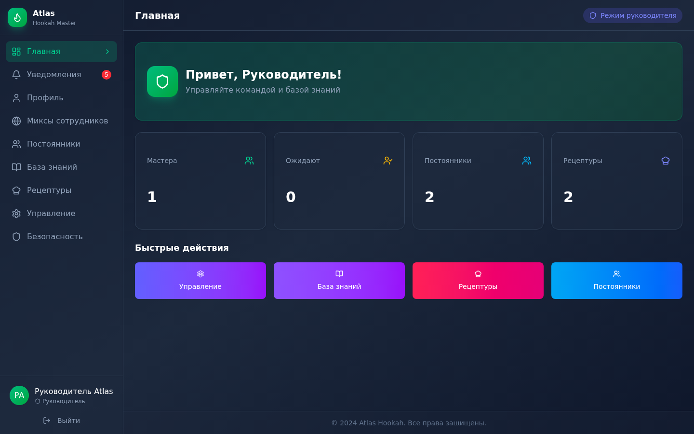
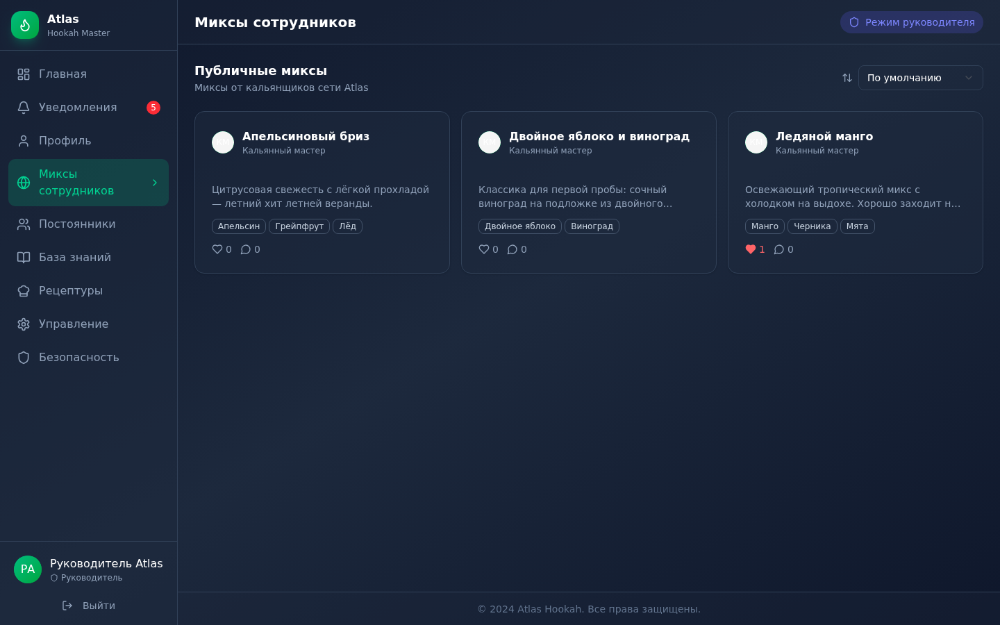
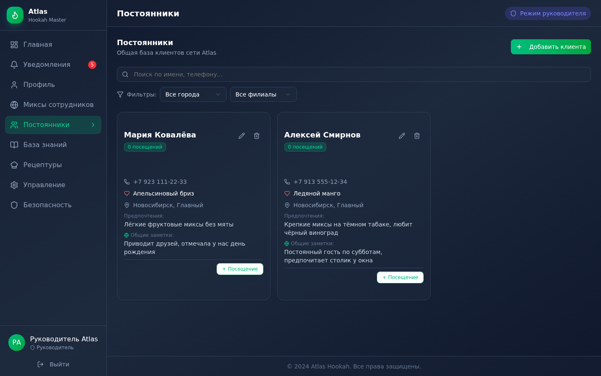
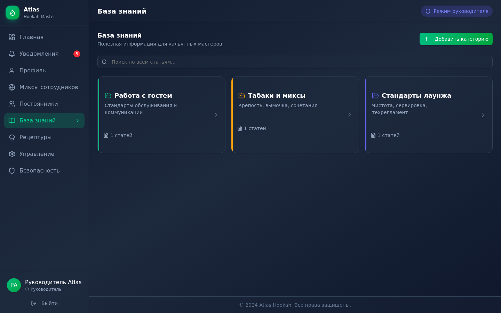
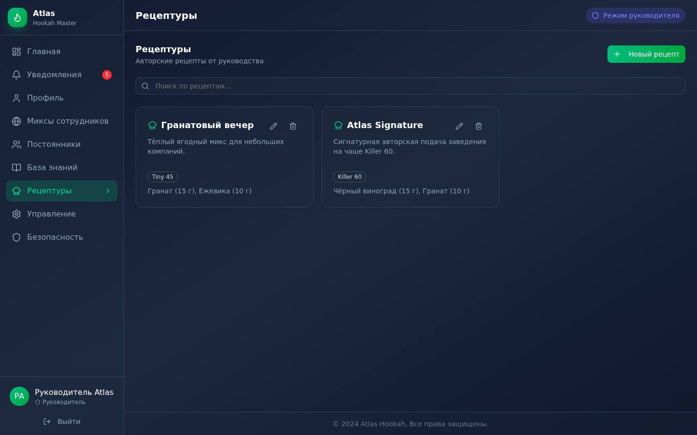
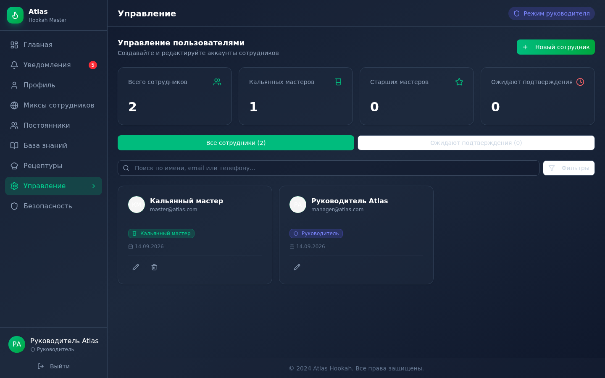
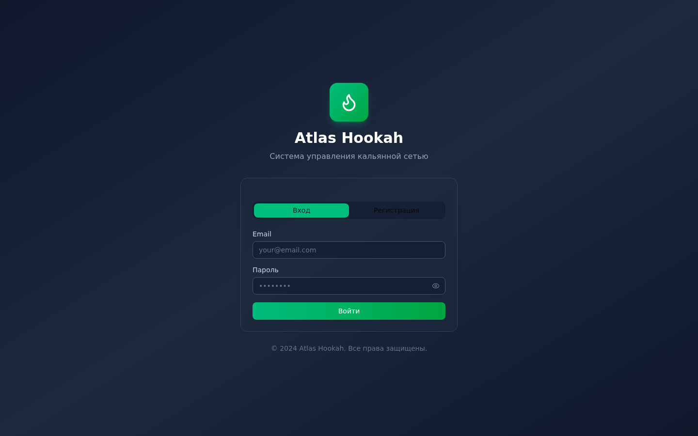
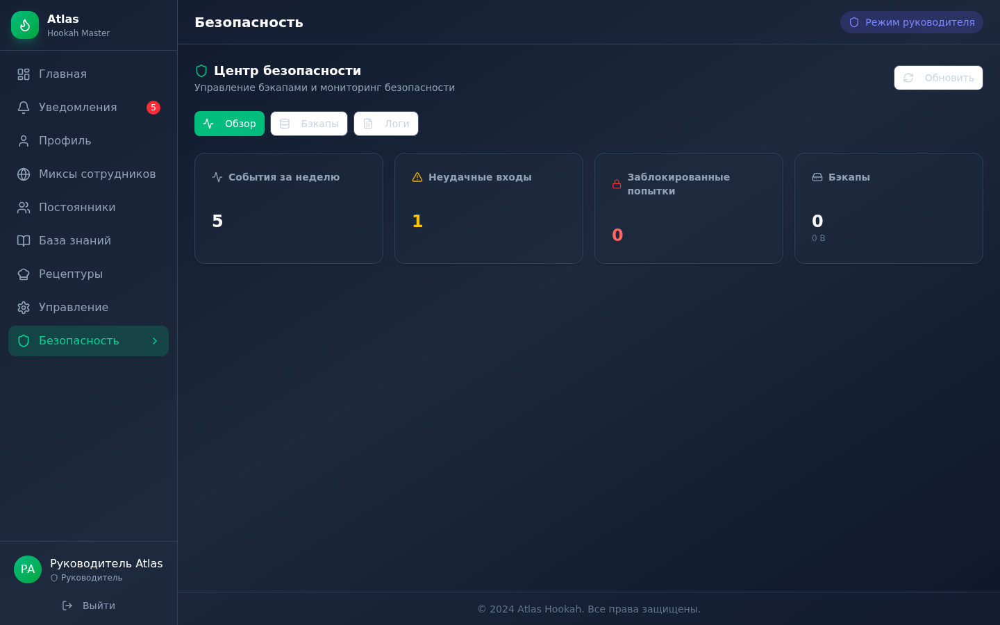
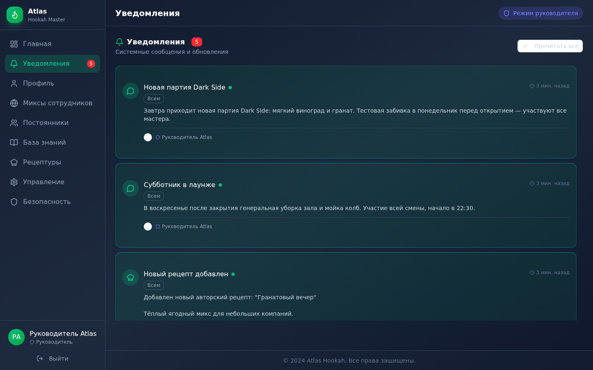

# 🎭 Atlas Hookah

**Система управления кальянной сетью** — full-stack веб-приложение для команды кальянной: личные и публичные миксы с лентой лайков и комментариев, авторские рецептуры от руководителя, CRM постоянных клиентов, база знаний с ролевой видимостью, инвентаризация табака и внутренние уведомления.


## ✨ Возможности

| Модуль | Что умеет |
|---|---|
| 🔐 **Аутентификация** | Серверные сессии с токенами (SHA-256 хеш в БД), PBKDF2-хеширование паролей, ролевая модель (HOOKAH_MASTER / SENIOR_MASTER / ADMIN / MANAGER), подтверждение аккаунтов руководителем, мгновенная деавторизация при удалении сотрудника |
| 🚬 **Миксы** | Личные и публичные миксы, ингредиенты (бренд/количество/слой), лайки, комментарии, авторский контроль доступа |
| 📋 **Рецептуры** | Официальные рецепты от руководителя с пошаговыми инструкциями и авто-уведомлениями команды |
| 👥 **Клиенты (CRM)** | База постоянных клиентов: предпочтения, любимые миксы, счётчик визитов; публичные и личные заметки каждого мастера о клиенте |
| 📚 **База знаний** | Категории и подкатегории, ролевая видимость статей (COMMON / MASTER / ADMIN), поиск, уведомления об изменениях |
| 📦 **Инвентаризация** | Учёт табака по категориям (A/C/D), калькуляция чистого веса с вычетом тары по справочнику контейнеров, сессии инвентаризации |
| 🔔 **Уведомления** | Адресные и широковещательные, таргетинг по городу/филиалу, статусы прочтения |
| 🛡 **Безопасность** | Rate limiting (логин/регистрация/уведомления/загрузки), защита от path traversal, CSRF-модуль, журналирование событий безопасности, санитизация и валидация всех входных данных |

## 📸 Скриншоты

<table>
  <tr>
    <td></td>
    <td></td>
  </tr>
  <tr>
    <td></td>
    <td></td>
  </tr>
  <tr>
    <td></td>
    <td></td>
  </tr>
</table>

<details>
<summary>Ещё скриншоты</summary>

| Вход | Центр безопасности | Уведомления |
|---|---|---|
|  |  |  |

</details>

## 🛠 Стек

- **Next.js 16** (App Router, Turbopack, standalone output) + **React 19**
- **TypeScript** (strict mode)
- **Prisma 6** — SQLite для разработки, PostgreSQL для продакшена (Vercel + Supabase)
- **Tailwind CSS 4** + **shadcn/ui** (Radix UI)
- **Bun** как пакетный менеджер и рантайм

## 🚀 Быстрый старт

Требования: [Bun](https://bun.sh) ≥ 1.2 или Node.js ≥ 20.

```bash
git clone https://github.com/burovgena-eng/atlas-hookah.git
cd atlas-hookah

bun install                # установка зависимостей (+ авто prisma generate)
bunx prisma db push        # создание SQLite-базы (prisma/dev.db)
bun run dev                # http://localhost:3000
```

При первом запуске создайте аккаунт руководителя через страницу регистрации — **первый зарегистрированный MANAGER подтверждается автоматически**.

Либо создайте демо-пользователей одним запросом (только на пустой базе):

```bash
curl -X POST http://localhost:3000/api/seed
# manager@atlas.com / 123456  (MANAGER)
# master@atlas.com  / 123456  (HOOKAH_MASTER)
```

> ⚠️ Для публичного деплоя удалите `/api/seed` или измените демо-пароли.

## 📦 Деплой на Vercel (PostgreSQL)

Пошаговое руководство — в [DEPLOY.md](DEPLOY.md): Supabase → Vercel → переменные окружения. Схема для продакшена подставляется автоматически (`vercel.json` → `schema.postgres.prisma`).

## 🗂 Структура проекта

```
src/
├── app/
│   ├── api/              # 18 REST-эндпоинтов (auth, mixes, clients, knowledge, ...)
│   ├── upload/[type]/    # защищённая отдача загруженных файлов
│   └── layout.tsx        # корневой layout с метаданными
├── components/
│   ├── sections/         # 12 секций приложения (dashboard, mixes, CRM, ...)
│   ├── auth/             # страница входа/регистрации
│   └── ui/               # shadcn/ui компоненты
├── hooks/                # use-auth (сессии + интерцептор), use-notifications
├── lib/
│   ├── auth.ts           # серверные сессии: выпуск/проверка/инвалидация токенов
│   ├── db.ts             # синглтон Prisma Client
│   ├── rate-limit.ts     # in-memory rate limiter
│   ├── csrf.ts           # CSRF-токены (timing-safe сравнение)
│   ├── security-logger.ts# журнал событий безопасности
│   ├── backup.ts         # бэкап/восстановление БД
│   └── validation.ts     # валидация и санитизация входных данных
└── types/                # общие TypeScript-типы
```

## 🔒 Модель безопасности

- **Пароли** — PBKDF2-SHA512 (10 000 итераций, случайная соль), сравнение хешей timing-safe
- **Сессии** — случайный 256-битный токен, в БД только SHA-256 хеш; TTL 30 дней; инвалидация при выходе и удалении пользователя
- **Авторизация** — актор определяется **исключительно по серверной сессии** (`X-Session-Token`), а не по переданным клиентом ID
- **Валидация** — все входные данные проходят через утилиты `lib/validation.ts` (длины, форматы, enum'ы, пагинация)
- **Загрузка файлов** — проверка MIME, magic numbers, whitelist расширений, криптостойкие имена, лимит 5 МБ
- **Rate limiting** — вход: 5/мин с блокировкой 15 мин; регистрация: 3/час; уведомления: 10/мин; загрузки: 20/мин
- Журнал безопасности пишется в `logs/security-YYYY-MM-DD.log` (доступен руководителю через UI)

## 🧪 Сборка

```bash
bun run build    # production-сборка (Turbopack, standalone)
bun run start    # запуск standalone-сервера
bun run lint     # ESLint
```

## 👤 Автор

**[burovgena-eng](https://github.com/burovgena-eng)**

Проект разработан как демонстрация навыков fullstack-разработки: от проектирования схемы БД и REST API до UI, аутентификации и контейнеризации.

## 📄 Авторские права

**© 2026 Буров Геннадий Владиславович. Все права защищены** (All rights reserved).

Репозиторий опубликован исключительно в качестве портфолио — для изучения кода и демонстрации навыков. Копирование, переиспользование, распространение и создание производных работ (код, дизайн, тексты, изображения) без письменного разрешения автора запрещены.

Файл `LICENSE` намеренно отсутствует: без открытой лицензии по умолчанию действует режим «все права защищены». Все данные на скриншотах и в seed-аккаунтах вымышленные. Сторонние библиотеки используются под их собственными open-source лицензиями (полный список — в `bun.lock`); Next.js, React, Prisma, Tailwind CSS и shadcn/ui — товарные знаки их владельцев, упомянуты исключительно для описания стека технологий.
